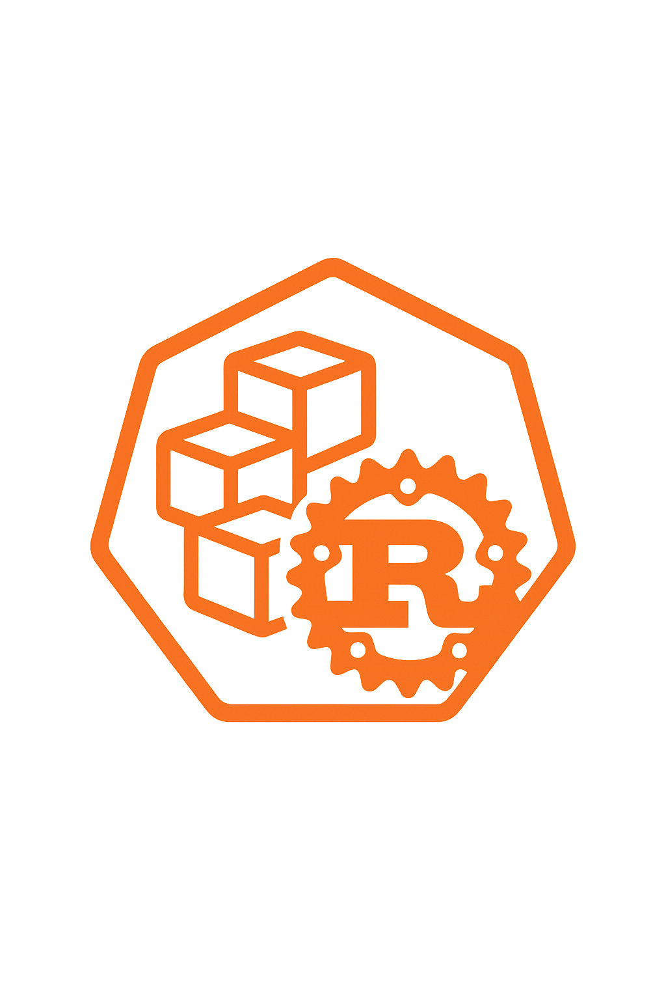

# r8s

Lightweight Kubernetes-Inspired Orchestrator in Rust

## Build Commands

- `make build` — Compile cli tool
- `make docker` — Build Docker images for all components
- `make docker-<component>` — Build Docker image for a specific component
